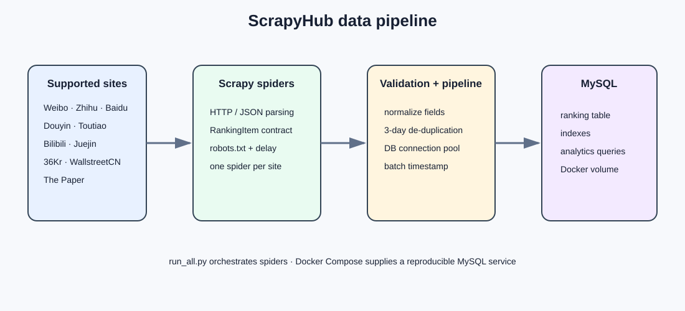
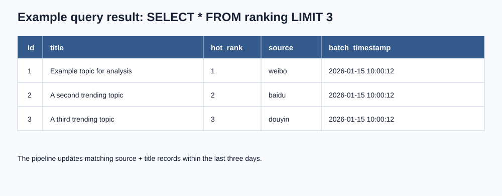
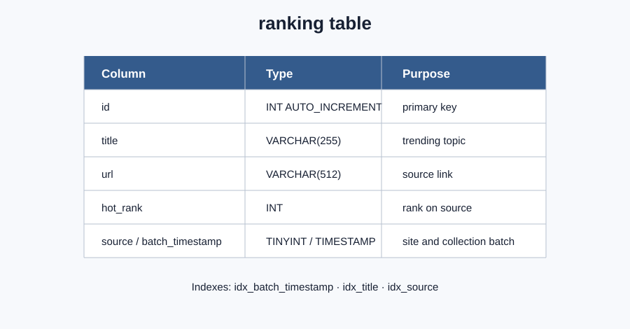
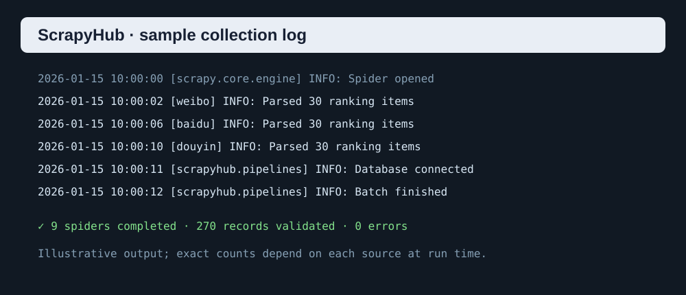

# ScrapyHub

> Collect trending topics from multiple platforms and store them in MySQL for analysis.

[Demo](docs/run-log.svg) · [Documentation](#quick-start) · [Docker](#docker-first-setup) · [License](LICENSE) · [中文 README](README.zh-CN.md)



ScrapyHub is a Scrapy-based collector for developers, data analysts, researchers, and students who need a small, repeatable dataset of public trending lists. Each source is isolated in a spider, while validation, de-duplication, and persistence are shared by one pipeline.

## What it supports

| Platform | Spider | Platform | Spider |
| --- | --- | --- | --- |
| Weibo | `weibo` | Zhihu | `zhihu` |
| Baidu | `baidu` | 36Kr | `36kr` |
| Douyin | `douyin` | WallstreetCN | `wallstreetcn` |
| The Paper | `thepaper` | Toutiao | `toutiao` |
| Bilibili | `bilibili` | Juejin | `juejin` |

The upstream sites can change their APIs or markup. A spider may therefore need maintenance when a source changes.

## Quick start

### Docker-first setup

The default path only requires Docker, Python, and Git:

```bash
cp .env.example .env
docker compose up -d
python run_all.py
```

`docker compose up -d` starts MySQL 8.4 with a persistent `mysql_data` volume. The Python process runs on the host and connects through `127.0.0.1:3306`. The pipeline creates the `ranking` table automatically on first run.

### Local setup without Docker

```bash
python -m venv .venv
# Windows
.venv\Scripts\activate
# macOS/Linux
source .venv/bin/activate

python -m pip install -r requirements.txt
cp .env.example .env
# Edit .env with an existing MySQL connection
python run_all.py
```

Run one spider when debugging:

```bash
python run.py weibo
scrapy list
```

Make targets are also available: `make db-up`, `make run`, `make test`, and `make lint`.

## Output

Every record is normalized to this shape before writing:

```json
{
  "title": "Example trending topic",
  "url": "https://example.com/topic",
  "hot_rank": 1,
  "source": "weibo"
}
```

The MySQL table is `ranking`. Records with the same source and title within three days are updated instead of inserted again.



## Screenshots and diagrams

The repository includes lightweight, versionable SVG assets so the documentation renders without an external image host:

- [Overall architecture](docs/architecture.svg)
- [Database schema](docs/database-schema.svg)
- [Sample crawler log](docs/run-log.svg)
- [Sample database result](docs/database-result.svg)





## Configuration

Copy `.env.example` to `.env` and adjust the values when needed:

```dotenv
MYSQL_HOST=127.0.0.1
MYSQL_PORT=3306
MYSQL_USER=scrapyhub
MYSQL_PASSWORD=scrapyhub
MYSQL_DATABASE=hot_list
MYSQL_CHARSET=utf8mb4
LOG_LEVEL=INFO
```

Never commit `.env` or production credentials. `ROBOTSTXT_OBEY` is enabled by default and requests use a conservative delay; individual spiders may override it only where their endpoint requires it.

## Development and tests

Install the dependencies and run the test suite:

```bash
python -m pip install -r requirements.txt
python -m pytest -q
```

The tests cover:

- HTML/JSON spider parsing;
- item format validation and normalization;
- pipeline de-duplication (update vs. insert);
- database table creation and write statements using a mocked connection.

## Responsible Use

This project is intended for learning, research and authorized data collection.
Please respect each website's terms of service, robots.txt, rate limits and applicable laws.

Do not use this project to bypass access controls, evade anti-bot measures, or collect private data. Before deploying a scheduled collector, confirm that you have permission to access and store the data.

## Project layout

```text
.
├── docker-compose.yml       # Reproducible MySQL service
├── .env.example             # Safe configuration template
├── Makefile                 # Common development commands
├── run.py / run_all.py      # Single/all-spider entry points
├── docs/                    # Architecture, schema, log, and result visuals
├── tests/                   # Parser, validation, pipeline, and DB tests
└── scrapyhub/
    ├── items.py             # RankingItem and data contract
    ├── pipelines.py         # Validation, de-duplication, MySQL writes
    ├── settings.py          # Scrapy and MySQL settings
    └── spiders/             # One spider per supported source
```

## License

ScrapyHub is released under the [MIT License](LICENSE).
